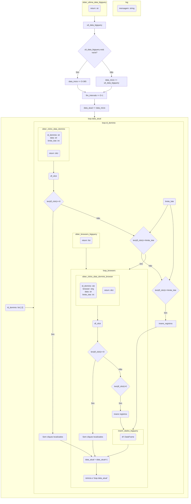

# Short.io obter os cliques nos links encurtados
Python que obtem detalhes dos cliques no Short.io e insere no BigQuery

### Tecnologias Utilizadas

[![Short.io](https://img.shields.io/badge/Short.io-404040?style=flat&logo=data:image/jpeg;base64,/9j/2wBDAAYEBQYFBAYGBQYHBwYIChAKCgkJChQODwwQFxQYGBcUFhYaHSUfGhsjHBYWICwgIyYnKSopGR8tMC0oMCUoKSj/2wBDAQcHBwoIChMKChMoGhYaKCgoKCgoKCgoKCgoKCgoKCgoKCgoKCgoKCgoKCgoKCgoKCgoKCgoKCgoKCgoKCgoKCj/wAARCACMAIwDASIAAhEBAxEB/8QAHQABAAICAwEBAAAAAAAAAAAAAAcIBQYBAgQDCf/EADwQAAEDAwIDBQQJAwMFAAAAAAEAAgMEBREGIRIxQQcTIlFhMnGBkQgUFSNCYnKCoVKSsTOishaTwuHw/8QAGwEBAAMAAwEAAAAAAAAAAAAAAAECBwQFBgP/xAAsEQEAAgEDAQUHBQAAAAAAAAAAAQIDBBExBRIhQVFxBiKBkaGx4RQjYdHw/9oADAMBAAIRAxEAPwDa0RFZk4iIgL32OzV18qDHb2ARMOJKiT/Tj9PzO9B8SNl305Zpb9dG0kbnRwMAfUSt5sZ0A/McED3E9MGZaGjp6CkipaSJsUETeFjG8gP/ALqk9zvekdInWfu5e6n3a3aNDWmiDX1cZuE45uqN2A+jOXzyfVbPDEyGNscTGsjbsGtAAHwC+iKN3tMGmxaevZxViBERQ+7xXW0268U31e7UFJXU+c91Uwtlbnzw4EKI9YfR+09cGST6WmlsNZuRE3MtK4894yct/YQB5FTSiCi2sdJ33Rde2l1JQmBj3cMNZES+mnO+A1+Bg7ey4B3osIr83a20V3t09BdKSCsop28MsE7A9jxz3B9cH4KqXbT2YRaCkp7laKwSWStqO4jpJ3kzU7y0uDWuP+ozDTz8TRjJdzARmiIgIiILDIiKzJxcOcGNLnHAaMk+S5X0paYVtbSUh9monjid+lzgHfxlStWs2tFY5lK2grV9maegMjMVNUBUTHqCRs34NwPgVsiDkipLUMGGuDHXHXiI2F8K6spqCklqq6ohpqaJvFJNM8MYweZcdgF91T7t31lU6t1nWW1sr/sGzzup4af8Es7PDJK4fiIdxNbnkASN3FH2ThX9u+gqWUshudVXYJaX0lFNIzbydw4PwJXus/bPoG6VEcDNQQ0k7+Ta+KSlH90jQ3+VT5HAOaWuALTzB6oP0BhljmiZLDI2SJ4DmvYchwPIghd1RPSGqb9oypE2mLlJSRl3FJRv+8ppeWeKM7AkDHE3hd6qzXZZ2xWrWUkVsuUbbTqEt2p3vzFUEczC/r58Bw4eoGUEpKof0g9Uf9S9ostHA/it1iDqSPydUHBmdy6Yaz9rvNWN7WNWt0VoW43ZhYa3hEFExxHjqH+FgweYB8RHk0qk8LCyMB73SPOXPe45L3E5Lj6kkn4oO6IiAiIgsMiIrMnFkdMgHVFnB5fWR/DXFY5eqzyinvlrmOwZVxZPvdwn/kpffTTEZqTPhMfdOg5IgRUaiL8+GNnZJUsqw4VLamcS8XPj713Fn45X6DqpX0gNDVGmNWVV9pYy6x3iYzOeASKapd7bXHoHnxNO25cPLIRgiIgLrIxsjcOHI5BBwQRyIPQ+q7Igz+ptY37VFpstvv8AW/W47T3hjlORJOXABrpd8Oc1uWh2MniJO5JOAREBERAREQWGREVmTi6Stc6NwY7hfjwnyPQ/Nd0QTdYriy62ejrY9u+jDnN/pd+IfA5CyCjHs3vYoqx1qqnhsFS/jp3HkJPxM/dzHrnzCk7KiWk9N1kavT1yRzxPqLz3GhpblQz0dwp4aqknYWSwzMD2PaeYIOxC9CKHPVm7ROwW4W2SSu0K411Du51rnkxNEM8opHbPAGfC8g7DxHkoVlbJBVTUtVDNTVkJxLTzxmOSM+TmnBC/QNa1rXQ+ntZ0gh1BboqiRgxFUt8E8P6JB4hzzjOD1BQUgRSvr3sN1Dp7vavTb36gtgy7ucBtZE3c+yMNl6ezhxz7JUTNeHF7dw5jix7XAtcxw5gg7g+hQdkREBERAREQWGREVmTiIiDhzQ4YO24IIOMEcjnopG0ZrBtSIbfeJAyt2ZFO7Zs/kD5P/g9PIR0ur2h7C1wBadiCjm6HX5dFk7ePjxjzWAGcbool09rGvtIbDVB9fRDYBzvvYx6OPtD0d8+ikayXy33mIvoKlr3N3fE7wyM97TuP8KNnudF1TBrI2pO1vKefz8GURMhFDshR52ndlNj1wx1Vwi231o8FxgYOJ+BgNlbt3jeXPcY2IUhogodqawXXSt8ms+oKYQVsY4muYSYqhmcCSN3Vp+YOxAKxiuv2l6Gt2vNOvt9f9zVR5ko6xjQX00uNnDzaeTm8iPXBFMLjQVlpudZbLrD3FxopTDPHvgOHVuebSCHA9QQg86IiAiIgsMiIrMnEREBERAXAy2RkjHPjlZuyRji1zfc4bhcoiYmY74bXZddXChIjubDcKcfjbhszR/xd/B96kOzXihvNN31uqGytGzm8nMPk5p3B96hFfSkqKiiq2VdDM6CpZ7L29R5EciPQ/wCd05d7oevZsExXN71fr8/H4p6RYLSF/Zf7aZSGx1cJ7ueIHPC7Gcj8pG4+XRZ1Ve2w5aZqRkpO8SKuP0qtNMpqyz6qpmNb37vs6tI24jguhcdtyMPbk/1NHRWOWgdvdtNz7IdTRsx3kFN9cYcZwYXCX/wx8UfRTpEzncckQEREFhkRFZk4iIgIs7oi0i739glaHUlK3vZgRs4nZjT7zk/t9VkNUaLnoHPqrKx9RRbl1MPFJF+j+pvpzHTPIHPx9Nz5dP8AqKRvH19WpIusb2yN4mEEctuh8l2RwBERBs/ZpM6LVT4m+xUUj+IeZY5vCf8Ac75qVm8gox7LqN0t6rK7H3dPD3AP5nkEj3gNH9wUnjkol732fraNHHa852/3qLWu03B7NtWZ5fZNXn/svWyrSO264NtnZJqyod+K3ywN/VKO7H8vCh3al1Lk00OefA3/AAvogAaA0chsEQEREFhkRFZk4ur3tYxz3nDWjJPkF2WT0xS09bqKghrZY44BJ3ha8471zd2sHqTg46gEI+mHFObJXHHMzskjQlndabDF37OGrqT384PNriNm/tGB7wVsRCN5DK5UNPwYa4MdcVOIa5qDSFtvLnTOY6mrDzqIMBzv1Dk74jPkQtIuWib3RkmnZDcIx1hcI3/2u2/3FS0mE3cDV9H0uqntWrtPnHd+EFPttzY7hfarkHeQpXu/kAhZG16UvVylaPqjqKAneap8OB1wz2ifQ4Hqpjx6lc4U7uvx+zWCtt7WmY8uGPsVpprLbo6Ojae7bu5zt3PcebnHzP8A6GAsgiKr0VKVpWK1jaIFB/0q759V0parDE8ia6VYlkAGfuYcPOf3mIfNTXV1MNHSzVNXKyGnhY6SWWRwa1jQMlxJ5AAZyqR9o+rHa41rW3wBzaLhFNQMcN207SSCdti8kvI6ZA6Is1xERAREQWGREVmTi6va17eF7Q5vUHquyINo05rSstYbT3ISVtGNhJnM0Y+Ptj3+L3qSLTdKK60/f2+pjnj5HhO7T5OHMH0Kg9IXyQztqKaSSnnGwkieWuHxHMeh2Tl3uh69m00RTL71fr8/7T9kIot0hrS7VV7FsrHQ1EYLfvXsxIc/pwP4UpKJjZ7LSaquqxxkpG0fyIiKHJF4rzdaCyW2e4XesgoqKAcUk07wxrfievTHVRF9IbtQvvZ7FTssUNA908ZJfUxueWnOMjDgPmCq43u+3fVVRFcNSXOquVRgPjEzgI4SQM93G0BreQ3Az6oJA7ZO1WbXT32iztlptMMeC4yAtkryDkFzTu2MEZDTucAnHJRmiICIiAiIg//Z&logoColor=white)](#)

[![API](https://img.shields.io/badge/API-404040?style=flat&logo=data:image/png;base64,iVBORw0KGgoAAAANSUhEUgAAAGAAAABgCAYAAADimHc4AAAACXBIWXMAAAsTAAALEwEAmpwYAAAHe0lEQVR4nO2dWYwVRRSGBxBkE1QMKEpQRNkFQU1AcUESJUTUqKDgBg+a4Dg+qHEHNEGND0ZAJBiNKKhIRAwajQKSsChRE5eoD+CDiDqsoqggMPCZQ05PDm11374z93bfpb6kE7qprqp7/q6qU1Wne2pqPB6Px+PxeDwej8fjqWqAfsDVwA3+oJA2EJv2izP8WcCneIrNOqB32PinAvVFL9oT8BtwihXgxcb/8qTFPCuAf/rT5xcrwGFHgq+A+SkcH1K+rAFeBfbreb32Jpv0/BCwGPjAce9hK4CLATUpALQAdlGetNff8IaeT9XzK/R8nfmN28M35xJgOXAncEeRj+coXxYA9wO79fw7oE5bhvAv8BjwrOvmXAJ4iowXIGO8ABnjBSghAZ72B6nbIA0v05ME4AF/kLoNrACeDPACZEw5CfB5E9aY1lPilJMAjzRhXJMlgZKm7AQARiRYWxrhBcifBuCbBALMSpDXrAQCfA8cIGNKpQU0ALcC7YAVKQgg+96dgOuAg1S5AA1ifFOPKBEKJcAR45vyrs9ShKwFaABu0fKPA8YYEVaa9fTXg3COPAWQKI/XgH1h40tZUqb++yatS1UJEDb+Wr02yYgwFehq6tgKWJQgb0nTytx3EnCXMf4kLWutEWFiFiJkJYDL+AGNIpi6jQJeAnaQnB16z2WhvALjB1gRbk5bhCwEaOzzgQ7A6qg0wEXAJwUoU7qe0cCEiP5+vRHhxjRFSFsAa/yOoSc/jCtKo7nE5Sl16ah1u12jGSpKAPlBt+V48rPGtoTJaYiQpgCTzeAaRAyUIlK3dlpXmVVXjAASvNRS42PmNiOff4Bl6uNfq0sTw4FrgLuBdzRNU5mrdWyRRrhm2mNAc0T4Sbqw4OmMQ1uZ9OObS9n4WXlB+YrQILNgoK2ZC1wMPAG8r4OnLFUv1X3WkZK3pm0LPJrQq0nd+FnOAxZomS1yjAd/AFcaw0sL2Jiwtcgg2tLMeiWvKNYY0WQfgUoX4CMtszuwNyKNXD9P03Vt4nxgfRCDL3nlKKu7pltdDQKM1TLnxPjrEzRNL2BLM8qS1tDHTLKi5gKzNY28SlTRAmzSMaCTWSQL84rW6XjgB5qPdFudNU9ZnHOxT+vUGviVChHgBMfRwSx+RRmih6ZZSOF4U/PsGSP8RDNLd9W9vATI4SqK1+Jirv7/0ALPRKXrGaZ5z4tIszRHnQtOKpkDvzuOKOOOCr3wYHlZx4SvQ9ff1oE6eFKHmPvFDR2kXtASzVsW5lwcctW1EgRIyi7gGKCNw238S9b1jVtpqY1pZcFT/yWwR/NubV6oKMbvKFsB1mh6WV4I81TIuBvCAgDPANuA8WYfwQogjNTzdUX8HWUrwFuafnzo+h7z9F/qaAW1Ibd2pp4PcwgQDLRLivg7ylaAOZq+NnT9SWPQjWa1ckNIgD7AJdKN6fnDDgHqQmIV43eUrQALzdbg/55+Rx8/JmoMAK7SGW5YgCn5urjVJMBK03eHn/7O6gEFx7GmFdSalrMiNHkLCxB4WYmXNqpJgM1mBiwvPv8NdNFr4Vihh/T6WMcYQIQAsh/cRRcBEy9vVJMAwmC952N5lV+e9FCLCNgJnKg+/xEPCXjXkW6cup5i8BWa7lzyoBIEGOY4rBtpma73yG6XsDVm6WCXjhEygfoxIs1e87QH7unjEWk3uOpa9gK4AO6JuG27CaBK7Ksn4DPtejqqqC7qctS54BQ1c+13w8cyLa9HzNLwDONWJp6xxvBn8N0L3UlzIXU5zayYuupedgJEcaGW+V7E/8um+hDz0QuJD20qB0zM6dCYTZnlmmYAKZKVAIuMQQ5HpJEN9W6abngTv2e0IwhNlLyAnyPSSR3O13TNidgoGwHWmXJXxaSTFzZ6GgPOSxhKflA31oPtyNOBb2PSrzL1iXo/oWIE+EL8/DwikrcF6z96zxn6eZg1ocF0uw7aDwJnmvSXu77TE6LBrBF1jvHQyl6AfI1vu4ilwd5uyDMRH7+N43pfDdJKSiYipClAU41vadAn/16dTNl3B7rptfvMuwb5kroIaQowWstp38wohzD7zffaCsEW8xmyC4oUpZ2JALuNp3F2mpEHeSBjSv8065j2GLDbBFuVmghbzWQttbpl4QXtNJOsvjH+vbic03KEFOYj/LSYaAipQ18z+5av2lb0PEAmSOfEiDDXxGpKlMMM8x3OfJDds+mSh+blCgjOzPhZCoD65oPM19rrHVHKA0Ou5eCEsZurg2Vtc29/k28gQr15/TV142ctQDDJGmhEmGmM9LymkUWwKcYzyec94XZ6r4SvC7NN/jOzNn4pCBC0hMYnXY0jhgpTV6A35ecH3VspOAOlIEDQEgbEGL+QAjSKkLXxS0mAoD+OilwutADBJ4czd4NLSYBcBAJMSPClrODdAv/BpgJSV5MnXoDCsrgJX2WXe0oa+7QUddHJ4+SoP+CQiR9c5Rz1J0xSfT3Tc4QXrADyyqhvBekhLvDJYa+hd45PyHgKg+zq9Ypz3/poTKX/U4YU1AbjXPvaHo/H4/F4PB6Px+Px1FQV/wHPDvPiSFUV2AAAAABJRU5ErkJggg==&logoColor=white)](#)

# UML do desenvolvimento

